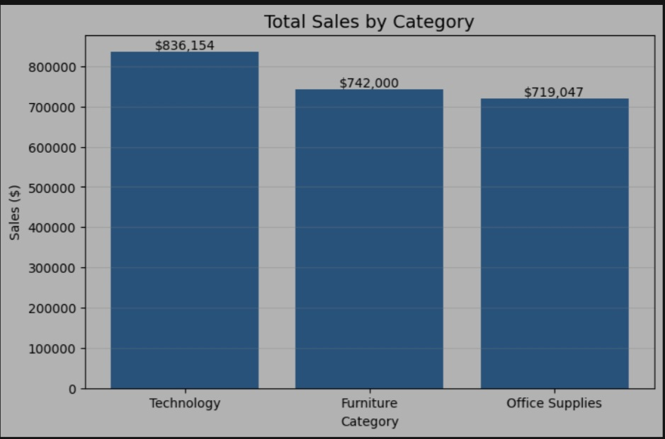
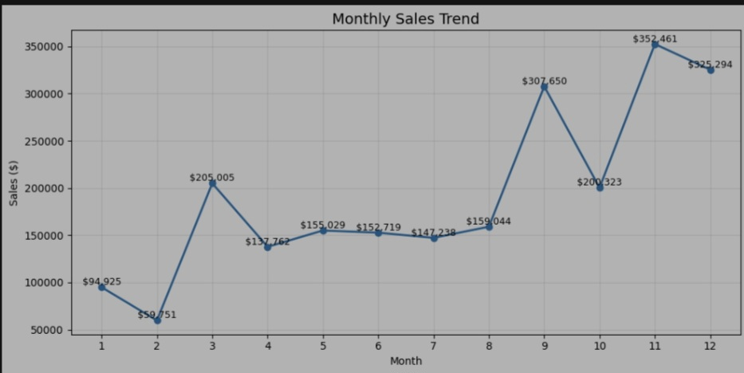
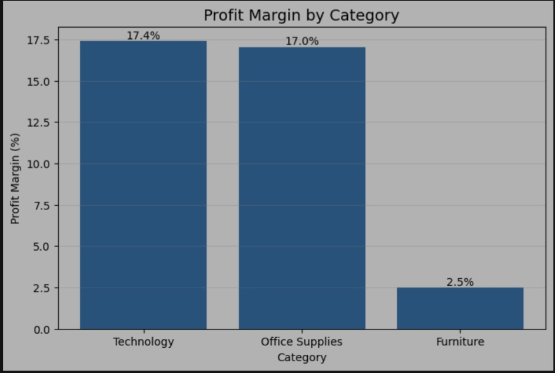
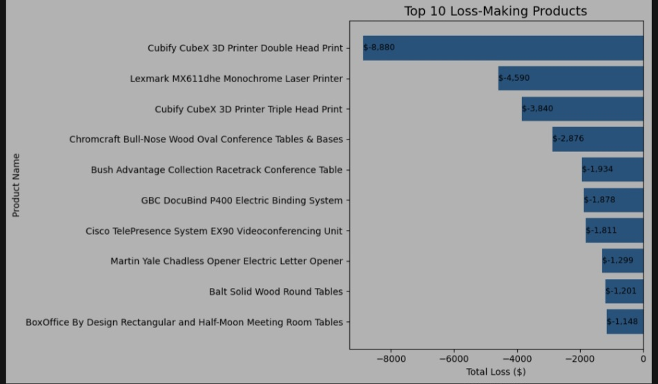

# 📊 Sales Analytics Dashboard

An end-to-end sales analytics project built using **Python, Pandas, SQL, and Data Visualization**.

This project analyzes the Superstore dataset to discover business insights related to sales performance, profitability, customer behavior, regional performance, and product analysis.

🔗 **Live Dashboard:**  
https://sales-analytics-dashboard-2026.streamlit.app/

---

# 🚀 Project Overview

This project focuses on transforming raw sales data into meaningful business insights through data analysis and visualization techniques.

The main objectives are:

- Analyze sales performance
- Identify profitable categories and products
- Understand customer behavior
- Discover seasonal sales patterns
- Support business decision-making using data insights

---
## 📊 Dashboard Preview


# 🛠️ Technologies Used

- Python
- Pandas
- NumPy
- Matplotlib
- Seaborn
- Streamlit
- GitHub

---

## 📂 Project Structure

```text
Sales-Analytics-Dashboard/

│
├── 📁 dashboard/
│   └── 📄 app.py
│
├── 📁 images/
│   ├── 🖼️ sales_by_category.jpg
│   ├── 🖼️ annual_sales_growth.jpg
│   ├── 🖼️ monthly_sales_trend.jpg
│   ├── 🖼️ profit_margin_category.jpg
│   ├── 🖼️ loss_making_products.jpg
│   └── 🖼️ correlation_heatmap.jpg
│
├── 📁 .devcontainer/
│
├── 📓 01_Sales_Analytics_EDA.ipynb
│
├── 📓 02_Sales_Analytics_Final.ipynb
│
├── 📄 requirements.txt
│
├── 📄 .gitignore
│
└── 📄 README.md
```


---

# 📈 Dashboard Features

The interactive dashboard provides:

## Business KPIs

- Total Sales
- Total Profit
- Profit Margin
- Total Orders
- Total Customers

---

# 🔍 Data Analysis Performed

## 1. Sales Performance Analysis

Analyzed sales contribution across different categories.

### Key Insight:
Technology achieved the highest sales performance compared with other categories.

---

## 2. Profitability Analysis

Evaluated profit margins across product categories.

### Key Insight:
Technology achieved the highest profit margin, while Furniture showed lower profitability efficiency.

---

## 3. Sales Growth Analysis

Analyzed yearly sales performance from 2014 to 2017.

### Key Insight:
Sales showed continuous growth, with the highest revenue recorded in 2017.

---

## 4. Seasonal Sales Analysis

Studied monthly sales patterns to identify demand changes.

### Key Insight:
November and December recorded the strongest sales performance, indicating higher seasonal demand.

---

## 5. Customer Segment Analysis

Compared sales and profit contribution across customer segments.

### Key Insight:
Consumer customers generated the highest sales and profit contribution.

---

## 6. Regional Performance Analysis

Analyzed sales and profitability across regions.

### Key Insight:
West region achieved the highest sales and profit performance.

---

## 7. Product Performance Analysis

Identified products generating significant losses.

### Key Insight:
Loss-making products require further review of pricing, discounts, and cost structure.

---

# 📊 Dashboard Preview














---

# 📌 Dataset

Dataset Used:

**Superstore Sales Dataset**

The dataset contains information about:

- Orders
- Customers
- Products
- Categories
- Sales
- Profit
- Discounts
- Regions

---

# 💡 Business Recommendations

Based on the analysis:

- Increase focus on Technology products due to strong sales and profitability.
- Improve Furniture profitability through pricing and cost optimization.
- Optimize discount strategies to protect profit margins.
- Prepare inventory and marketing campaigns before peak sales periods.
- Review loss-making products and improve product strategy.

---

# 🌐 Live Application

The dashboard is available online:

https://sales-analytics-dashboard-2026.streamlit.app/

---

# 👨‍💻 Author

**Asala AI**

GitHub:

https://github.com/asala-ai
